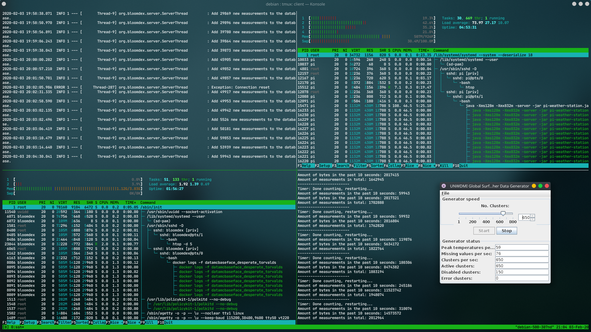
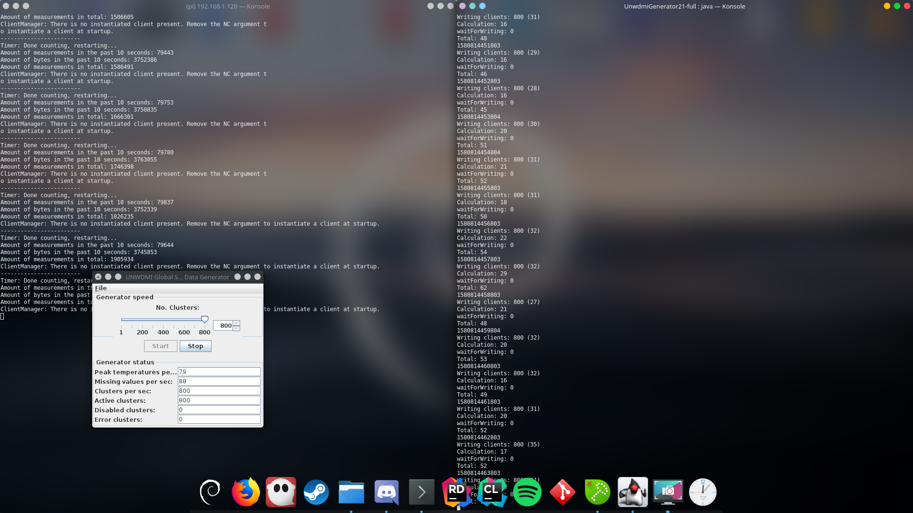

<p align="center">
	
</p>

# Documentation

## Roles, Code and Installation Instructions:

Note: [Eloy](https://github.com/eloykrikken) helped all around.

* Website: [https://github.com/Bloomdex/2.2-website](https://github.com/Bloomdex/2.2-website)
	- Made by [Mees](https://github.com/mees-)
* Filter-Station: [https://github.com/Bloomdex/2.2-pi-weather-station](https://github.com/Bloomdex/2.2-pi-weather-station)
	- Made by [Thomas](https://github.com/ThowV)
	- Client connection code made by [Bart](https://github.com/Badkuip)
* Database: [https://github.com/Bloomdex/2.2-vps-database](https://github.com/Bloomdex/2.2-vps-database)
	- Made by [Lutzen](https://github.com/LutzenH)
	- Client connection code made by [Bart](https://github.com/Badkuip)
* Presentation: [https://github.com/Bloomdex/2.2-docs/blob/master/documents/formal_meeting_2_presentation.pdf](https://github.com/Bloomdex/2.2-docs/blob/master/documents/formal_meeting_2_presentation.pdf)

## Specifications

The client requested the following features to be implemented:

* Data-connection between the vps and the raspberry pi has to be encrypted
* Historical data should be visible of the last-month
* Data needs to be reported to the raspberry-pi every 10 seconds (+- 80.000 measurements).
* A Map with locations of weather-stations in South-America
* A web-app with the colors of the client-company
* First sight should be Top 10 Locations for planting roses and a map of South-America with possible growing locations.
* Should show: Rainfall, (peak) temperatures and humidity
* Support for low-bandwith internet
* Metric system as unit of measurement
* Three levels of authentication

## Operating System Virtual Machine

The operating system we've chosen to run the Database and website on is: Ubuntu Server 18.04 LTS
Because there is a lot of documentation online to setup the operating system and it is a long-term release, which means the operating itself does not change much apart from security-updates. The underlying OS did not matter a lot to us, as long it supported recent versions of Docker.

## Operating System Raspberry Pi

Initially we chose to use Raspbian Lite, as it was lightweight and easy to install.  
Later in the project it seemed the application was performing worse than expected. Looking for reasons online resulted in the following solution: 32-bit Operating Systems can't handle buffers as well as 64-bit Operating systems.

With that information in mind we chose to start using OpenSuse JeOS. It is leightweight, has no desktop environment which would be unnecessary and is 64-bits. In the end it didn't raise the performance too much but we kept the operating system.

## JVM Raspberry Pi

Currently the Raspberry Pi is using the HotSpot JVM. OpenJDK, the default JDK for Linux used HotSpot. When we installed OpenJDK 11 we didn't experience the best performance, so after we switched Operating System we decided to use Adopt OpenJDK 8 which also uses the HotSpot JVM.  
In the end using HotSpot JVM payed off as we reached the goal of parsing 8000 measurement every second.

## Transportation of data between VM and Raspberry Pi

Transportation of information between the raspberry pi and the VM is done using a TLSv1.2, Because the customer required a encrypted connection between the client and the server. We don't use rsync and mounted drives because we wanted a fast way to get data from the raspberry-pi to the vps-database. To get this fast-connection we decided to not use any storage-medium until the end of the information transport chain.

## Approachability Raspberry Pi to VM

In order for the raspberry pi and the vm to know eachothers ip-adresses we've setup Dynamic name records updating using a curl to an API of the dns-server on both the VM and the Raspberry Pi, This way, instead of using an IP-adress directly, they use  DNS-server first to retrieve the ip-adress from there.

## Configuration Changes

### VM

- **DNS:** We've added a systemd unit to the VM, which performs a curl to the api of our domain-provider to update it's A Record to the newly allocated ip-adress. This way to server is always accessable using the domain-name.

- **Docker** We've installed the `docker.io` package on the VM in order to be able to run our own docker-containers.

	- There are in total 3 docker containers installed on the VM, The database, The website and an automated nginx reverse proxy.
	- On the docker-container for the database, openjdk's jre8-alpine is used as a base-image.

- **Certbot:** We've installed certbot inorder to generate https-certificates for use on our website. Certbot automatically updates these certificates when they are in 30 days of renewal.

- **SSH:** We've removed the SSH-key that was generated by school, and created our own instead for security reasons.

### Raspberry Pi

- **Operating SystemL** As the Operating System we used was light enough we did not change anything in the Operating System configurations except for the password of course.

- **JVM** When launching a .jar we told the JVM how much memory to use and to use the server garbage collector using the -server argument, which yielded better results.

### XML-parsing & Data Correction

- The Raspberry Pi gets an XML file every second on 800 seperate threads.
- Each thread reads the XML file line by line and keeps an index of this line, which is later used for data correction.
- As the XML file is being read the data in the line is being checked for credibility. If it isn't credible it'll be corrected.
	+ Corrections are done using Exponential Weighted Moving Average.
	+ Every weather station instance, found using the stn number in the XML file, has a buffer containing the last measurement of every type.
	+ Using the index mentioned before, we get the last measurement that corresponds to the current measurement in the XML file and we extrapolate this.
	+ The extrapolation method has a weight factor that'll make sure that only the paste 30 measurements will have an effect on the current calculated value, which was also a requirement.
- After data is corrected it'll be parsed into bytes, added to an array that consists of all the measurements in the XML and sent off to a manager that'll keep this parsed and corrected data until it needs to be sent.
- Every 10 seconds all parsed and corrected data is sent towards the database server and cleared from the application, making way for new measurements to be saved.

Actual parsing (entire code would be too long and complex):

```java
// Here we create a ByteBuffer,
// allocate the amount of bytes a float uses,
// Add the measurement (which could be corrected) to the buffer,
// Turn the buffer into an array of bytes, which is being assigned to a value in the actual code.
ByteBuffer.allocate(Float.BYTES).putFloat(currentMeasurement).array();
```

Data correction method: 

```java
// Stands for Calculate Exponential (Weighted) Moving Average
static float calcEMA(Float lastMeasurement, Float lastEma) {
    float weight = 0.06542f; // Weight factor mentioned before.

	// These statements are useful when:
	// - There is no reason to calculate EMA because we know it already
	// - It can't be calculated with the given data.
    if (lastMeasurement == null && lastEma == null)
        return Float.MIN_VALUE;
    else if(lastMeasurement != null && lastEma == null)
        return lastMeasurement;

	// Actual EMA calculation.
    return weight * lastMeasurement + (1 - weight) * lastEma;
}
```

### Multithreading & Synchronization

- Every established connection to the generator gets its own thread as shown in the following snippet, (see comments in the code for further documentation):

```java
// A thread pool with 800 threads so the application does not have to create them at runtime which decreases performance.
//The threadpool itself only increases startup time.
ExecutorService threadExecutor = Executors.newFixedThreadPool(800);

try {
	// Establish a connection to the server socket with the given port.
    ServerSocket serverSocket = new ServerSocket(7789);

	// While the established connection with the serverSocket is open.
    while(!serverSocket.isClosed()) { 
    	// Create a new thread using the accepted connection.
        threadExecutor.execute(new GeneratorConnectionThread(serverSocket.accept()));
    }
}
```

- Synchronisation is only used whenever a thread needs to add the parsed data to the data manager. Or whenever the timer tells the application it needs to send and clear all the gathered parsed data. See the following snippets, (documented further in the code):

```java
static void storeParsedMeasurementSet(Byte[] parsedMeasurementSet) {
	// The other threads wait for the thread accessing this method.
	// We do this to avoid inconsistencies in the data.
    synchronized (parsedMeasurementSets) {
        measurementSetAmount += 1;
        measurementSetMaxAmount += 1;
        parsedMeasurementSets.addAll(Arrays.asList(parsedMeasurementSet));
    }
}

// We get all the parsed measurements in primitive form.
public static byte[] getParsedMeasurementSetsPrim() {
    byte[] parsedMeasurementSetsPrim;

	// This is synchronized to avoid new data from being added whilst we are reading.
	// If it wasn't it could miss data or cause other issues.
    synchronized (parsedMeasurementSets) {
        parsedMeasurementSetsPrim = new byte[parsedMeasurementSets.size()];

        for(int i = 0; i < parsedMeasurementSetsPrim.length; i++) {
            parsedMeasurementSetsPrim[i] = parsedMeasurementSets.get(i);
        }
    }

    return parsedMeasurementSetsPrim;
}
```

### Storage type

The data is stored in a hibernated h2-database, h2-database files are automatically encrypted, small in size and stored on the storage-device of the VM.

## Presentation

* We've build a RESTful-API in order to retrieve information from the database, This API requires http-basic-authentication to be accessed (with different levels of authentication).
* The website is build using type-script and react and runs on nginx, the website does RESTful API-requests to the database in order to function.
* The map on the website is made using open-street-maps and pigeon-maps.
* The graph on the website is made using recharts.

## Stress-test

In the next images you'll find that the application itself notifies you of the performance. Together with the ```htop``` command we were able to observe the performance.

The first stress test using 650 Clusters performed successfully. The database, left 2 panes, and the Raspberry Pi, right 2 panes, managed to keep up.



[Link to larger image](images/stress-test-1.png)

After optimizing the code on the Raspberry Pi by removing unneeded buffers and simplifying calculations we've managed to get to 800 Clusters per seconds successfully:



[Link to larger image](images/stress-test-2.png)

Keep in mind that performance may vary based on the Operating System and the Java Virtual Machine used.  
Given the right OS and JVM are installed using the Readme situated [here](https://github.com/Bloomdex/2.2-pi-weather-station/blob/master/README.md) you'll find that the application can handle the required workload of 8000 measurements each seconds (800 threads each receiving 10 measurements each second).
